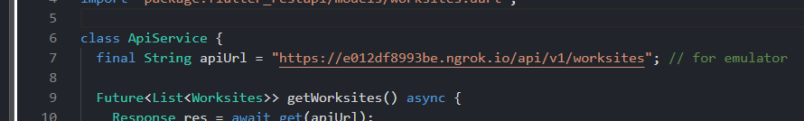
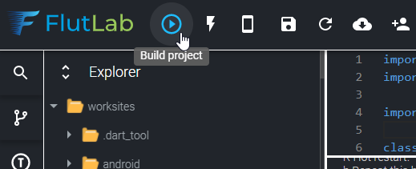
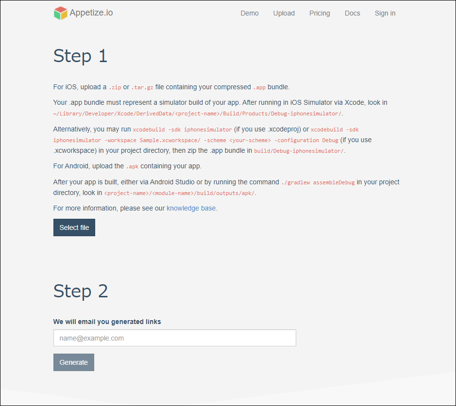
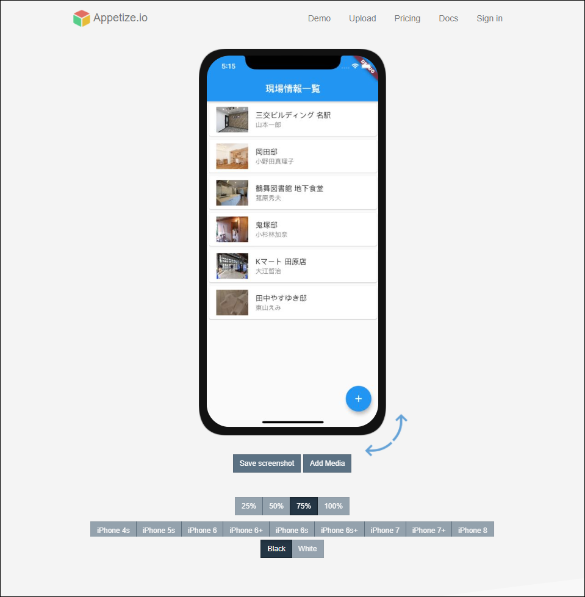

# ローカルの API サーバと iPhone を Windows でテストする方法
ローカル PC の API サーバと iPhone エミュレータの疎通テストを Windows で行ってみる。

## 実行環境
Windows 10

## 利用ツール・サービス
- ngrok（SSH トンネリングサービス）
- Flutlab.io（Flutter オンライン IDE）
- Appetize.io（ネイティブアプリ Web ブラウザ実行環境）

## ローカル開発 API サーバの外部公開
ローカルで開発している API は ngrok を使って、外部からアクセスできるようにしておく。

参考: ngrok の利用方法  
https://github.com/fs5013-furi-sutao/how-to-use-ngrok

以下の例では、ngrok を使って API サーバを以下のアドレスにマッピングしたこととする。
```
https://d901ce7882ad.ngrok.io/
```

## Flutter アプリのビルド
Flutter アプリのビルドには、Flutlab.io を利用する。

Flutlab.io は、Flutter 専用のオンライン IDE である。この IDE を使えば、iOS 用のインストーラをビルドできる。

### サインアップ
自分のプロジェクトをアップロードする機能を使うには、ユーザ登録をしないといけない。

### プロジェクトをアップロード
ビルドしたいプロジェクトを zip ファイルにして、アップロードをする。

### （作業の注意点）API サーバの URL
Flutter アプリに実装した API サーバの URL を ngrok で設定した URL に修正しておくこと。



### ビルド設定
オンライン IDE の左サイドバーに歯車アイコンがある。ここから Build 設定ができる。

Target を選択することで、iOS か、Android か、 Web か、どのインストーラをビルドするかを選択できる。

### ビルド実行
オンライン IDE の上部メニューに「再生ボタン」マークの Build Project があるので、クリックしてビルドを実行する。ビルドには時間が掛かる（4 画面で 1 ～ 2 分程度）ので、ビルドが完了するまで待つ。



### iOS 用ビルド結果の zip ファイルをダウンロード
ビルドが完了したら、IDE の下部コンソールにビルド結果をダウンロードするリンクが表示される。

このリンクをクリックして、 zip ファイルをダウンロードする。

IDE のコンソールには、ビルド結果へのリンクをメール送信するリンクも表示されるので、メールとして結果を残したい場合は、このリンクを利用しても良い。

### Appetize.io で iPhone アプリを動かす

ダウンロードした zip ファイルは、Appetize.io というサービスを利用して、ブラウザ上の仮想スマホにインストールする。

Appetize.io  
https://appetize.io

このサイトのヘッダナビから Upload  をクリックすると、ビルドファイルのアップロード画面に遷移する。



この画面での作業は以下の通り、2ステップだけ。

#### Step 1: アップロード
Flutlab.io でビルド、ダウンロードした zip ファイルをここからアップロードする。

アップロードが失敗しても、再度アップロードするとアップロードが成功することもある。

#### Step 2: メール送信
フォームに自分のメールアドレスを入力して「Generate」ボタンを押すと、シミュレーション画面へのリンクが本文に記載されたメールが送信される。

受信したメールのリンクをクリックして、シミュレーション画面でアプリをさわってみよう。



## まとめ
以下の手順で、ローカル開発の API サーバに問い合わせる Flutter 製 iPhone アプリをシミュレーション画面で動作確認できることがわかった。

1. ngrok でローカルサーバを一時的に外部に公開
2. Flutlab.io でプロジェクトを iOS 用でビルド
3. Appetize.io にビルド結果をアップロード
4. シミュレーション画面で動作確認
